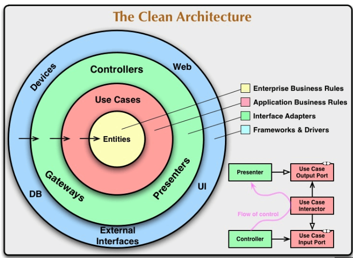

# Arquitetura Limpa - POC

## Pré-requisitos

- Java 17
- Maven
- Docker
- Docker Compose

## EXECUTAR

1. Construa, inicie e execute os containers Docker:
    ```sh
    docker-compose up --build 
    ```
   OU
   ```sh
    docker-compose up -d 
    ```

## Endpoints

Na pasta raiz deste projeto tem a collection que pode ser importado no postman para teste

## OBJETIVO

O Objetivo desse projeto é o estudo do clean architecture e a implementação de um simples crud.

# Projeto com Arquitetura Limpa

Este projeto segue os princípios da Arquitetura Limpa, proposta por Robert C. Martin (Uncle Bob), para criar um sistema flexível, testável e fácil de manter.



## Visão Geral da Arquitetura Limpa

A Arquitetura Limpa visa criar sistemas:

* **Independentes de frameworks:** O código de negócio não depende de bibliotecas ou frameworks específicos.
* **Testáveis:** A lógica de negócio é facilmente testável, pois não está acoplada a detalhes externos.
* **Independentes de UI:** A interface do usuário pode mudar sem afetar o código de negócio.
* **Independentes de banco de dados:** O banco de dados pode ser trocado sem afetar o código de negócio.
* **Independentes de agentes externos:** Sistemas externos (APIs, serviços) podem ser substituídos sem afetar o código de negócio.

A arquitetura se organiza em camadas concêntricas, onde as camadas mais internas são as mais abstratas e as externas, as mais concretas. A dependência é sempre para dentro.

## Análise do Código

O projeto está organizado em camadas, cada uma com responsabilidades bem definidas:

### 1. Entidades (Domain - Core)

* `br.com.cleanarchitecture.crud.domain.entities.usuario.Usuario`: Representa a entidade principal do domínio, com lógica de negócio essencial.
* Value Objects (VOs): `CPF`, `Email`, `Telefone`, `CEP` e `Endereco` encapsulam a lógica de validação dos dados.
* `FabricaDeUsuarioBuilder`: Padrão de projeto Builder para facilitar a construção de objetos `Usuario`.
* Testes unitários: Validam as regras de negócio das entidades.

**Observações:**

* As entidades são puras, sem dependências externas.
* Os Value Objects (VOs) encapsulam lógica de validação.

### 2. Casos de Uso (Use Cases - Interactors)

* `br.com.cleanarchitecture.crud.domain.usecases.CriarUsuarioUseCase` e `br.com.cleanarchitecture.crud.domain.usecases.ListarUsuariosUseCase`: Representam as regras de negócio da aplicação.
* Orquestram a interação entre as entidades e os gateways.
* Dependem apenas das entidades e dos gateways.
* Recebem o `RepositorioDeUsuarios` por injeção de dependência.

**Observações:**

* Os casos de uso são independentes de frameworks e detalhes de implementação.
* Eles definem o que o sistema faz, não como.

### 3. Gateways (Interface Adapters)

* `br.com.cleanarchitecture.crud.application.gateways.RepositorioDeUsuariosGateway`: Define a interface para acessar o repositório de dados.
* Isola os casos de uso dos detalhes de persistência.
* `br.com.cleanarchitecture.crud.adapter.gatewaysImpl.RepositorioDeUsuarioJPAGatewayImpl`: Implementa a interface `RepositorioDeUsuarios` usando JPA.
* Adapta os dados do domínio para o formato do banco de dados e vice-versa.
* `UsuarioEntityMapper`: Mapeia a entidade do domínio para a entidade do banco de dados.

**Observações:**

* Os gateways são responsáveis por adaptar os dados entre as camadas internas e externas.
* Eles permitem que o sistema seja flexível em relação à tecnologia de persistência.

### 4. Frameworks e Drivers (Frameworks & Drivers)

* `br.com.cleanarchitecture.crud.application.controller.UsuarioController`: Lida com as requisições HTTP e utiliza DTOs (`UsuarioRequestDto` e `UsuarioResponseDto`).
* `br.com.cleanarchitecture.crud.adapter.persistence.UsuarioEntity` e `br.com.cleanarchitecture.crud.adapter.persistence.UsuarioRepository`: Implementação do banco de dados usando JPA.
* `br.com.cleanarchitecture.crud.adapter.config.UsuarioConfig`: Classe de configuração do Spring para injeção de dependência.
* `br.com.cleanarchitecture.crud.CrudApplication`: Classe que inicializa o Spring Boot.

**Observações:**

* Esta camada contém os detalhes de implementação (frameworks, banco de dados, etc.).
* Ela depende das camadas internas, mas não o contrário.

## Princípios da Arquitetura Limpa Observados

* **Inversão de Dependência:** Os casos de uso dependem de abstrações (interfaces) em vez de implementações concretas.
* **Separação de Responsabilidades:** Cada camada tem uma responsabilidade bem definida.
* **Independência de Frameworks:** O código de negócio (entidades e casos de uso) não depende do Spring Boot ou JPA.
* **Testabilidade:** O código é facilmente testável, pois as dependências são isoladas.

## Comunicação entre as Camadas

A comunicação entre as camadas segue os seguintes princípios:

* **Dependência Unidirecional:** As dependências sempre apontam para dentro.
* **Abstrações (Interfaces):** A comunicação é feita através de interfaces.
* **Modelos de Dados (DTOs):** Os dados são transferidos entre as camadas usando DTOs.
* **Injeção de Dependência:** As dependências são injetadas nas camadas.

### Fluxo de Comunicação

1.  **Controlador → Casos de Uso:** O controlador recebe requisições e chama os casos de uso, passando os dados como parâmetros.
2.  **Casos de Uso → Entidades:** Os casos de uso manipulam as entidades através de seus métodos públicos.
3.  **Casos de Uso → Gateways:** Os casos de uso utilizam a interface `RepositorioDeUsuarios` para acessar o banco de dados.
4.  **Gateways → Banco de Dados:** O gateway utiliza JPA para se comunicar com o banco de dados.
5.  **Casos de Uso → Controlador:** Os casos de uso retornam os dados para o controlador, que os converte para DTOs e envia como resposta.

### Exemplo Prático

Ao cadastrar um novo usuário:

1.  O `UsuarioController` recebe os dados no formato `UsuarioRequestDto`.
2.  Cria um objeto `Usuario` e chama o método `cadastrarUsuario` do `CriarUsuarioUseCase`.
3.  O `CriarUsuarioUseCase` utiliza o `RepositorioDeUsuarios` para persistir o usuário.
4.  O `RepositorioDeUsuarios` converte o objeto `Usuario` para `UsuarioEntity` e salva no banco.
5.  O `UsuarioController` recebe o objeto `Usuario` salvo, converte para `UsuarioResponseDto` e retorna.

## Conclusão

Este projeto demonstra os princípios da Arquitetura Limpa, resultando em um sistema flexível, testável e fácil de manter.